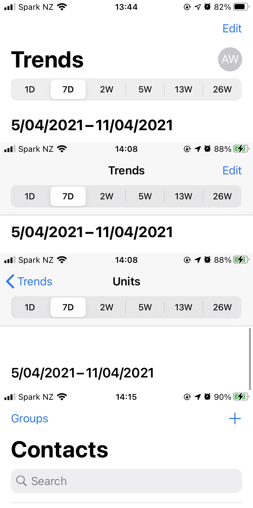
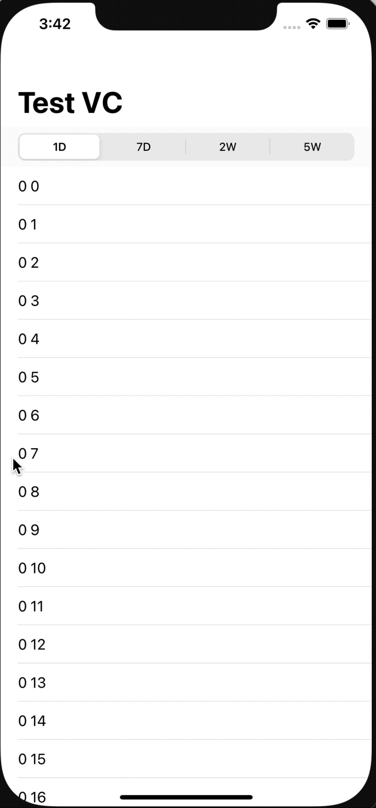

# Add a Segment Control just under the Navigation Bar

The reason I want to implement a segment control just under the navigation bar is I notice that Apple's official app, App Store Connect, has a great user experience regarding combine segment control and navigation bar together. And my project just has similar requirements.

The screenshot just as you can see from below. And you may try it yourself if you are interested.

I searched on [Stackoverflow](https://stackoverflow.com/), but didn't find a perfect solution. And it seems that Apple does not provide its API to be public about this. 

I tried different ways on my own, but none of them is a perfect copy of App Store Connect. 

# My solution 

Here are the best ways I ever tried, in my opinion.

1. Customize your Navigation Bar which is inherited by `UINavigationBar`
2. Add `frame` observer on `_UINavigationBarLargeTitleView` and `alpha` observer on `_UINavigationBarContentView` sub title label to calculate `color`
2. Init a `UINavigationController` with your Navigation Bar
3. Add a `UISegmentControl` in a `UIBarButtonItem` 
4. Init a `UIToolbar` with the Bar Button Item and set it to be the first section header of a table
5. Set the toolbar top shadow line to nil and add another one to the bottom
6. Assign your navigation bar block to update the toolbar tint color and the shadow line alpha value

The result is not 100% the same as App Store Connect but met my request for temporary.

